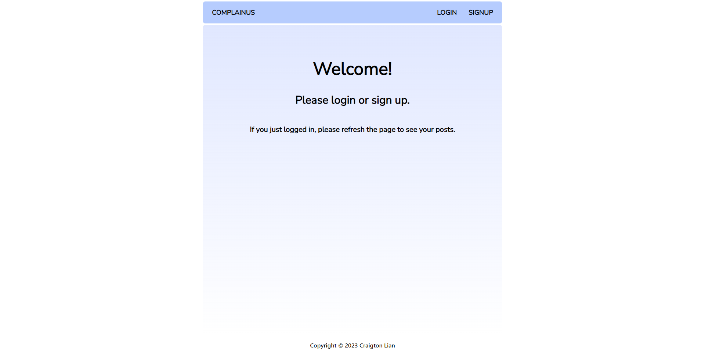

# ComplaiNUS React App
This is a CVWO project undertaken by Craigton in AY22/23 Winter.
It consists of two separate repositories for the [frontend](https://github.com/craigtonlian/complainus-frontend) and [backend](https://github.com/craigtonlian/complainus-backend).

This React App is deployed on [https://complainus.netlify.app](https://complainus.netlify.app).

## Getting Started
1. [Fork](https://docs.github.com/en/get-started/quickstart/fork-a-repo#forking-a-repository) this repo.
2. [Clone](https://docs.github.com/en/get-started/quickstart/fork-a-repo#cloning-your-forked-repository) **your** forked repo.
3. Open your terminal and navigate to the directory containing your cloned project.
4. Install dependencies for the project by entering this command:

```bash
npm install
```

5. Run the app in development mode by entering this command:

```bash
npm run start
```

6. Open [http://localhost:3001](http://localhost:3001) to view it in the browser.
7. You should see a page like this.
   
